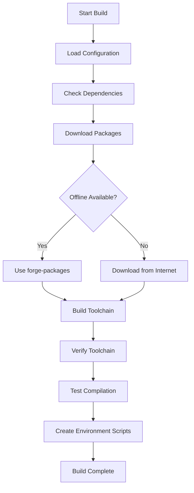

# ForgeOS Toolchain Build Process

**Version**: 1.0.0  
**Last Updated**: 2025-01-01  
**Status**: Complete

## Overview

This document describes the complete process for building ForgeOS cross-compilation toolchains, including package management, build configuration, and integration with the forge-packages repository.

## Table of Contents

1. [Architecture Overview](#architecture-overview)
2. [Package Management](#package-management)
3. [Toolchain Build Process](#toolchain-build-process)
4. [Configuration System](#configuration-system)
5. [Build Scripts](#build-scripts)
6. [Integration with forge-packages](#integration-with-forge-packages)
7. [Troubleshooting](#troubleshooting)

## Architecture Overview

### Repository Structure

```
forge-toolchain/
├── docs/                       # Documentation
│   ├── toolchain-build-process.md
│   ├── package-management.md
│   └── integration-guide.md
├── scripts/                    # Build and management scripts
│   ├── build_musl.sh          # musl toolchain builder
│   ├── build_glibc.sh          # glibc toolchain builder
│   ├── build_all.sh            # Build all toolchains
│   ├── download_packages.sh    # Package downloader
│   ├── check_dependencies.sh   # Dependency checker
│   ├── verify_toolchain.sh     # Toolchain verifier
│   ├── test_toolchain.sh       # Toolchain tester
│   └── load_config.sh          # Configuration loader
├── configs/                    # Toolchain configurations
│   ├── musl-config.mk          # musl configuration
│   └── glibc-config.mk         # glibc configuration
├── artifacts/                  # Build outputs (gitignored)
│   ├── aarch64-musl/          # musl toolchain
│   └── aarch64-gnu/           # glibc toolchain
├── packages/                   # Package downloads (gitignored)
│   └── downloads/             # Downloaded packages
├── build.json                 # Build configuration
├── Makefile                   # Main build orchestrator
└── README.md                  # Project documentation
```

### Build Flow



## Package Management

### Package Sources

The toolchain build system supports multiple package sources:

#### 1. forge-packages Repository (Primary)

**URL**: `https://github.com/your-org/forge-packages.git`  
**Purpose**: Centralized package management for ForgeOS ecosystem  
**Benefits**: Offline builds, integrity verification, version pinning

**Package Categories**:
- **toolchain/**: binutils, gcc, musl, glibc, musl-cross-make
- **kernel/**: Linux kernel source and headers
- **userland/**: busybox, iproute2, chrony
- **system/**: dropbear, nftables, apk-tools

#### 2. Internet Downloads (Fallback)

**Sources**: Official project websites and mirrors  
**Purpose**: Fallback when forge-packages not available  
**Benefits**: Always up-to-date, no dependency on forge-packages

**Download Sources**:
- **GNU**: `https://ftp.gnu.org/gnu/`
- **Kernel**: `https://www.kernel.org/pub/linux/kernel/`
- **GitHub**: `https://github.com/`
- **Project Sites**: Official project websites

### Package Download Process

#### Step 1: Check forge-packages Availability

```bash
# Check if forge-packages is available
if [[ -f "packages/forge-packages/metadata/packages.json" ]]; then
    echo "Using forge-packages repository"
    source packages/forge-packages/metadata/packages.json
else
    echo "forge-packages not available, using internet downloads"
fi
```

#### Step 2: Download Packages

**From forge-packages**:
```bash
# Download from forge-packages
./scripts/download_packages.sh
```

**From Internet**:
```bash
# Download from internet (fallback)
curl -L "$PACKAGE_URL" -o "$PACKAGE_FILE"
```

#### Step 3: Verify Package Integrity

```bash
# Verify SHA256 checksum
echo "$EXPECTED_SHA256  $PACKAGE_FILE" | sha256sum -c

# Verify GPG signature (if available)
gpg --verify "$PACKAGE_FILE.sig" "$PACKAGE_FILE"
```

### Package Configuration

#### Package Manifest (packages.json)

```json
{
  "metadata": {
    "version": "1.0.0",
    "description": "ForgeOS Package Manifest",
    "last_updated": "2025-01-01T00:00:00Z"
  },
  "packages": {
    "toolchain": {
      "binutils": {
        "version": "2.42",
        "url": "https://ftp.gnu.org/gnu/binutils/binutils-2.42.tar.xz",
        "filename": "binutils-2.42.tar.xz",
        "sha256": "a4b4c23b2534e67a2c8b8a4c4c4c4c4c4c4c4c4c4c4c4c4c4c4c4c4c4c4c4c4",
        "category": "toolchain"
      }
    }
  }
}
```

## Toolchain Build Process

### Supported Toolchains

#### 1. musl Toolchain (Default)

**Target**: `aarch64-linux-musl`  
**Cross-compile**: `aarch64-linux-musl-`  
**Features**: Static linking, minimal dependencies, edge-optimized

**Build Process**:
1. **Download musl-cross-make**: From forge-packages or internet
2. **Configure Build**: Set target architecture and options
3. **Build Toolchain**: Compile binutils, gcc, musl
4. **Install**: Install to artifacts directory
5. **Verify**: Test toolchain functionality

**Configuration**:
```bash
# musl-cross-make configuration
TARGET = aarch64-linux-musl
OUTPUT = artifacts/aarch64-musl
GCC_CONFIG += --enable-languages=c,c++
GCC_CONFIG += --disable-multilib
MUSL_CONFIG += --enable-shared
MUSL_CONFIG += --enable-static
```

#### 2. glibc Toolchain (Optional)

**Target**: `aarch64-linux-gnu`  
**Cross-compile**: `aarch64-linux-gnu-`  
**Features**: Full compatibility, dynamic linking, server-optimized

**Build Process**:
1. **Download Sources**: binutils, gcc, glibc, Linux headers
2. **Build binutils**: Cross-assembler and linker
3. **Install Headers**: Linux kernel headers
4. **Build glibc**: C library
5. **Build GCC**: Cross-compiler
6. **Verify**: Test toolchain functionality

**Configuration**:
```bash
# glibc toolchain configuration
TARGET = aarch64-linux-gnu
OUTPUT = artifacts/aarch64-gnu
BINUTILS_CONFIG += --disable-multilib
GLIBC_CONFIG += --enable-shared
GLIBC_CONFIG += --enable-static
GCC_CONFIG += --enable-languages=c,c++
```

### Build Scripts

#### build_musl.sh

**Purpose**: Build musl-based cross-compilation toolchain  
**Usage**: `./scripts/build_musl.sh <arch> <build_dir> <artifacts_dir> [platform]`

**Process**:
1. **Check Dependencies**: Verify build requirements
2. **Download musl-cross-make**: From forge-packages or internet
3. **Configure Build**: Set target and build options
4. **Build Toolchain**: Compile all components
5. **Verify Toolchain**: Test functionality
6. **Create Environment**: Generate environment scripts

#### build_glibc.sh

**Purpose**: Build glibc-based cross-compilation toolchain  
**Usage**: `./scripts/build_glibc.sh <arch> <build_dir> <artifacts_dir> [platform]`

**Process**:
1. **Download Sources**: binutils, gcc, glibc, Linux headers
2. **Build binutils**: Cross-assembler and linker
3. **Install Headers**: Linux kernel headers
4. **Build glibc**: C library
5. **Build GCC**: Cross-compiler
6. **Verify Toolchain**: Test functionality

#### build_all.sh

**Purpose**: Build both musl and glibc toolchains  
**Usage**: `./scripts/build_all.sh <arch> <build_dir> <artifacts_dir> [platform]`

**Process**:
1. **Build musl Toolchain**: Call build_musl.sh
2. **Build glibc Toolchain**: Call build_glibc.sh
3. **Create Combined Environment**: Generate unified environment script
4. **Generate Summary**: Create build report

## Configuration System

### build.json Structure

```json
{
  "metadata": {
    "version": "1.0.0",
    "description": "ForgeOS Toolchain Build Configuration",
    "last_updated": "2025-01-01T00:00:00Z"
  },
  "build": {
    "directories": {
      "build": "build",
      "output": "artifacts",
      "packages": "packages/downloads"
    },
    "architecture": {
      "default": "aarch64",
      "supported": ["aarch64", "x86_64"]
    },
    "toolchain": {
      "types": ["musl", "gnu"],
      "default": "musl",
      "versions": {
        "binutils": "2.42",
        "gcc": "13.2.0",
        "musl": "1.2.4",
        "glibc": "2.38"
      }
    },
    "security": {
      "checksum_verification": true,
      "gpg_signatures": false
    }
  }
}
```

### Configuration Loading

#### load_config.sh

**Purpose**: Load build.json configuration into environment  
**Usage**: `source scripts/load_config.sh`

**Variables Set**:
- `ARCH`: Target architecture
- `TOOLCHAIN`: Toolchain type
- `TARGET`: Cross-compilation target
- `CROSS_COMPILE`: Cross-compilation prefix
- `BUILD_DIR`: Build directory
- `ARTIFACTS_DIR`: Artifacts directory
- `SOURCE_DATE_EPOCH`: Reproducible build timestamp

## Integration with forge-packages

### Package Download Integration

#### download_packages.sh

**Purpose**: Download packages from forge-packages repository  
**Usage**: `./scripts/download_packages.sh [forge-packages-url] [packages-dir]`

**Process**:
1. **Clone/Update forge-packages**: Git clone or pull updates
2. **Load Package Manifest**: Parse packages.json
3. **Download Packages**: Copy packages to local directory
4. **Verify Integrity**: Check SHA256 checksums
5. **Create Info File**: Generate package information

### Offline Build Support

**When forge-packages is available**:
```bash
# Use offline packages
export PACKAGES_DIR="packages/downloads"
make toolchain
```

**When forge-packages is not available**:
```bash
# Fallback to internet downloads
make toolchain
```

### Package Verification

#### verify_packages.sh

**Purpose**: Verify package integrity and availability  
**Usage**: `./scripts/verify_packages.sh [package-name]`

**Checks**:
- **File Existence**: Package files present
- **Checksum Verification**: SHA256 checksums match
- **Signature Verification**: GPG signatures valid
- **Dependency Check**: All required packages available

## Troubleshooting

### Common Issues

#### 1. Missing Dependencies

**Error**: `gcc: command not found`  
**Solution**: Install build dependencies
```bash
# Ubuntu/Debian
sudo apt-get install build-essential curl tar

# macOS
brew install gcc curl tar
```

#### 2. Package Download Failures

**Error**: `Failed to download package`  
**Solution**: Check network connectivity and package URLs
```bash
# Test connectivity
curl -I https://ftp.gnu.org/gnu/binutils/

# Check package URLs in packages.json
jq '.packages.toolchain.binutils.url' metadata/packages.json
```

#### 3. Build Failures

**Error**: `make: *** [all] Error 2`  
**Solution**: Check build logs and dependencies
```bash
# Check build logs
tail -f build.log

# Verify dependencies
./scripts/check_dependencies.sh
```

#### 4. Toolchain Verification Failures

**Error**: `Toolchain verification failed`  
**Solution**: Check toolchain installation and paths
```bash
# Verify toolchain paths
ls -la artifacts/aarch64-musl/bin/

# Test toolchain
artifacts/aarch64-musl/bin/aarch64-linux-musl-gcc --version
```

### Debug Information

#### Enable Verbose Output

```bash
# Enable debug output
export DEBUG=1
make toolchain

# Check configuration
./scripts/load_config.sh

# Verify packages
./scripts/verify_packages.sh --verbose
```

#### Build Logs

**Location**: `build.log`  
**Content**: Build output, errors, warnings  
**Usage**: Debug build failures

**Example**:
```bash
# Monitor build progress
tail -f build.log

# Check for errors
grep -i error build.log
```

### Performance Optimization

#### Parallel Builds

**Default**: Use all available CPU cores  
**Override**: Set MAKE_JOBS environment variable
```bash
# Use 4 parallel jobs
export MAKE_JOBS=4
make toolchain

# Use all CPU cores
export MAKE_JOBS=$(nproc)
make toolchain
```

#### Build Caching

**Location**: `build/` directory  
**Purpose**: Cache build artifacts for faster rebuilds  
**Clean**: `make clean` to remove cache

## Best Practices

### 1. Use forge-packages for Offline Builds

```bash
# Download packages once
make download-packages

# Build offline
make toolchain
```

### 2. Verify Toolchain After Build

```bash
# Build and verify
make toolchain
make verify
```

### 3. Use Reproducible Builds

```bash
# Set SOURCE_DATE_EPOCH for reproducible builds
export SOURCE_DATE_EPOCH=$(date +%s)
make toolchain
```

### 4. Test Toolchain Functionality

```bash
# Build and test
make toolchain
make test
```

### 5. Clean Build Artifacts

```bash
# Clean build artifacts
make clean

# Clean all artifacts
make clean-all
```

## Conclusion

The ForgeOS toolchain build process provides a robust, flexible system for building cross-compilation toolchains with support for both offline and online package management. The integration with forge-packages enables efficient, reproducible builds while maintaining fallback support for internet downloads.

For more information, see:
- [Package Management Documentation](package-management.md)
- [Integration Guide](integration-guide.md)
- [Main README](../README.md)
